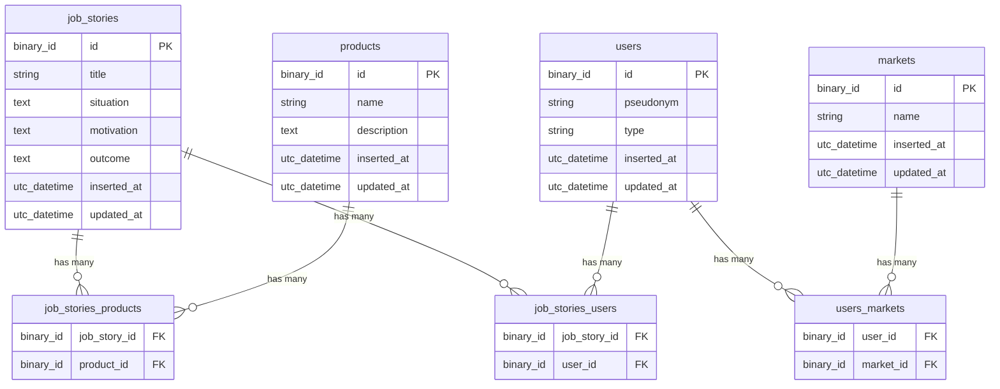

# Database

```mermaid
erDiagram
    job_stories {
        binary_id id PK
        string title
        text situation
        text motivation
        text outcome
        utc_datetime inserted_at
        utc_datetime updated_at
    }

    products {
        binary_id id PK
        string name
        text description
        utc_datetime inserted_at
        utc_datetime updated_at
    }

    markets {
        binary_id id PK
        string name
        utc_datetime inserted_at
        utc_datetime updated_at
    }

    users {
        binary_id id PK
        string pseudonym
        string type
        utc_datetime inserted_at
        utc_datetime updated_at
    }

    job_stories_products {
        binary_id job_story_id FK
        binary_id product_id FK
    }

    users_markets {
        binary_id user_id FK
        binary_id market_id FK
    }

    job_stories_users {
        binary_id job_story_id FK
        binary_id user_id FK
    }

    %% Many-to-many relationships
    job_stories ||--o{ job_stories_products : "has many"
    products ||--o{ job_stories_products : "has many"
    
    users ||--o{ users_markets : "has many"
    markets ||--o{ users_markets : "has many"
    
    job_stories ||--o{ job_stories_users : "has many"
    users ||--o{ job_stories_users : "has many"
```
